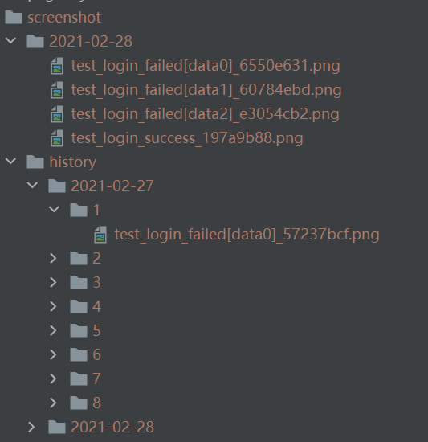
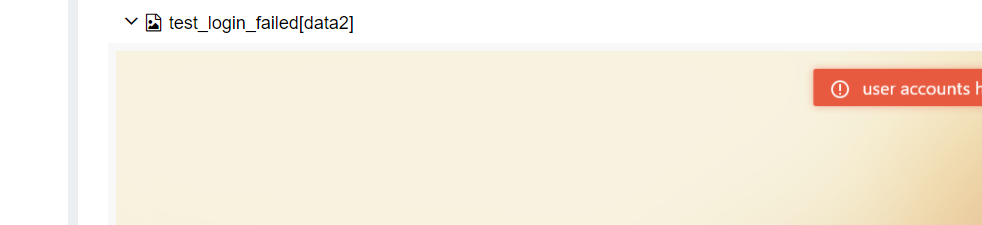

pytest-failed-screenshot: pytest plugin
==============

For UI automation test cases using selenium and appium, screenshots are saved when they fail, and are attached to the report when allure is used

用于使用了Selenium和Appium的UI自动化测试用例在失败时进行截图保存并且在开启allure的时候会将截图附加到报告上

install
=====

`pip install pytest-failed-screenshot`

Usage
=====

command line:`pytest --screenshot={on:off} --screenshot_path={on:off:absolute path}`

options:
- screenshot: Used to open plugin, default "off"
- screenshot_path: 
    - off: The default is 'off'. The screenshot will not be saved and will only be attached to the allure report.
    - on: The screenshots will be saved to the "./screenshot/%Y-%m-%d/" directory in the root path of the project. 
      If the directory has historical screenshots, the historical screenshots will be archived, moved to the "./screenshot/history/%Y-%m-%d/{times}" directory, 
      and attached to the allure report
    - Absolute path: The screenshot will be saved in that path and attached to the report.

选项:
- screenshot: 用于开启该插件,默认为"off"关闭状态
- screenshot_path:
    - off: 默认为"off"关闭状态,截图不进行保存,只附加到allure报告上
    - on: 截图将保存到项目根路径的"./screenshot/%Y-%m-%d/"目录,
      若该目录已有历史截图则将历史截图进行归档, 移动至"./screenshot/history/%Y-%m-%d/次数/"目录中,
      并且附加到allure报告上
    - 绝对路径: 截图将保存在指定的路径上,并且附加到allure报告上
    
tip:
- Support the use of pytest-xdist together

小贴士:
- 支持与pytest-xdist一起使用

