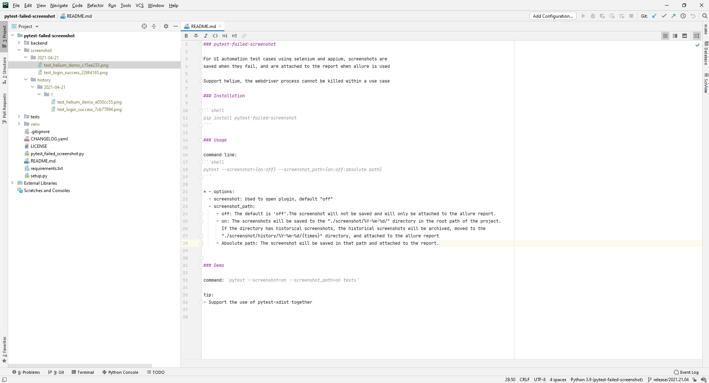

### pytest-failed-screenshot

For UI automation test cases using [selenium](https://github.com/SeleniumHQ/selenium/), [helium](https://github.com/mherrmann/selenium-python-helium) [appium](https://github.com/appium/python-client), screenshots are saved when they fail, 
and are attached to the report when allure is used.

Support:
- [selenium](https://github.com/SeleniumHQ/selenium/)
- [helium](https://github.com/mherrmann/selenium-python-helium)
- [appium](https://github.com/appium/python-client)
- [pytest-xdist](https://github.com/pytest-dev/pytest-xdist)

### Installation

```shell
pip install pytest-failed-screenshot
```

### Usage

command line: 
```shell
pytest --screenshot={on:off} --screenshot_path={on:off:absolute path}
```

* - options:
  - screenshot: Used to open plugin, default "off"
  - screenshot_path:
     - off: The default is 'off'.The screenshot will not be saved and will only be attached to the allure report.
     - on: The screenshots will be saved to the "./screenshot/%Y-%m-%d/" directory in the root path of the project.
       If the directory has historical screenshots, the historical screenshots will be archived, moved to the
       "./screenshot/history/%Y-%m-%d/{times}" directory, and attached to the allure report
     - Absolute path: The screenshot will be saved in that path and attached to the report.

    
### Demo

command: `pytest --screenshot=on --screenshot_path=on tests`


